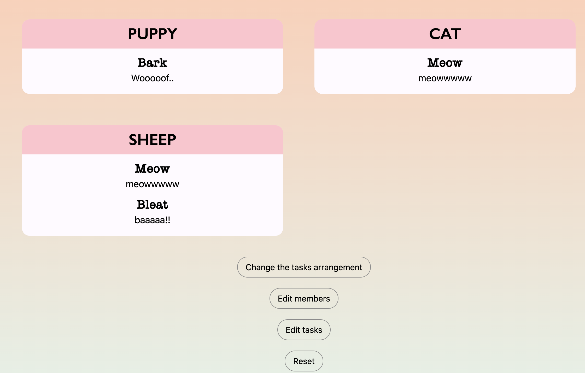

# Task Manager
Task manager is a web app coded with Ruby on Rails and React that helps the users manage and assign tasks. User data is stored in postgresql with password encrypted.  
After registration, users can add the members in their groups and the tasks they want to assign. 
The app supports features including rearranging tasks, editing members and tasks, switching tasks, and sending emails to members with their specific tasks.

Demo link: https://youtu.be/_QeHT6SNFNg

## Login/Registration
Directly sign in if you have created an account, otherwise register.
 

## After first time registration/Editing memebrs and tasks
Add new memebrs and tasks to start assigning the tasks. Users can edit the members and tasks at any time. 
 

## Arranging the tasks
Select the tasks you want to assign for each member and save the changes. Users will then be directed to the home page where all the updates are reflected.
 

## Home
Display the tasks for each member.
 

## Buttons on the home page

### _Make changes to tasks or memebrs_
Users can change the tasks arrangement, edit memebrs and tasks, and reset/clear all the memebers and tasks data by clicking on the corresponding buttons. 
### _Switch_
Switch the tasks among memebrs either clockwise or counterclockwise 
### _Send emails_ ###
1. Email template is stored in the app/views/user_mailer. chore.title & chore.description give the information about a specific task and member.name give the name of the member the email is sent to. Please edit the parts that are not part of the ruby codes to change the template.
2. Add a file called local_env.yml in the config folder to send emails to all the memebrs using your own email address and password as follows. 
 
3. Whenever the user click on the send emails button, emails will be sent to each memebr with their specific tasks.
### _Log out_
Log out the user. Users can access saved information at any time by signing in. 
